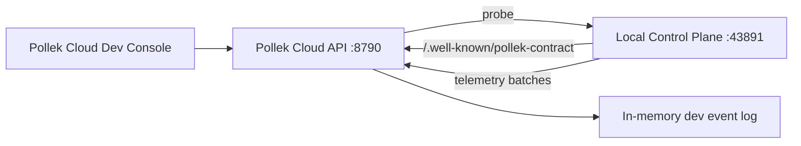

# Pollek Cloud Architecture

Pollek Cloud is a contract-first central control plane for Pollek Local Control Plane and Local Enforcement Kit deployments.

## Planes

- Identity and Trust Plane: OAuth/OIDC, mTLS-ready enrollment, SPIFFE ID conventions, trust-bundle rotation.
- Tenant and Authorization Plane: multi-tenant RBAC/ReBAC/Cedar/OPA authorization.
- Control Plane: tenants, sites, device groups, devices, Local Control Planes, tasks, rollouts.
- Policy Plane: drafts, simulations, approvals, bundle build/sign/publish/rollback.
- Contract Plane: `/.well-known/pollek-contract`, OpenAPI/JSON schemas, compatibility matrix.
- Observe Plane: telemetry ingest, OTEL/SIEM routing, decision search, alerts.
- Evidence Plane: audit timeline, hash-chain verification, compliance exports.

## Local Protocol Test Topology

The first dev server intentionally uses HTTP on loopback. It preserves the real contract, OAuth device flow, enrollment, telemetry, and cloud probe paths so the protocol can be tested before replacing the loopback transport with TLS/mTLS in a private cloud or SaaS deployment.
