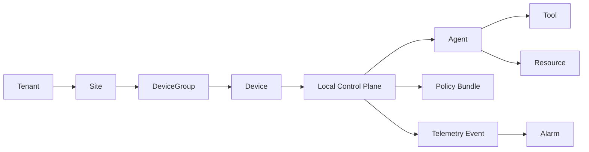

# vCenter-Style UX Research for Pollek Cloud

Pollek Cloud needs an operator console for many Local Control Plane instances. The closest enterprise UX pattern is a vCenter/vCloud Director style console: persistent inventory, dense object tables, detail tabs, alarms, tasks, and relationship context.

## Research Synthesis

| vCenter / Cloud Director Pattern | Pollek Cloud Translation |
|---|---|
| Inventory hierarchy is the primary navigation model. | Tenant > Site > Device Group > Device > Local Control Plane > Agent/Tool/Resource. |
| Object pages use consistent summary and tabbed detail surfaces. | Every object gets Summary, Relationships, Policies, Telemetry, Timeline, Alarms, Bundle Status, Audit, Settings. |
| Datagrid views support scanning many managed objects. | Local Control Planes list needs status, site, version, contract, active bundle, agents, policy coverage, heartbeat, and alarms. |
| Alarms and recent tasks stay visible while working. | Right-side operations rail shows open alarms, long-running tasks, and protocol probe state. |
| Relationship context explains blast radius. | Relationship map links LCPs to agents, bundles, resources, telemetry, incidents, and SPIFFE identity. |
| Provider/cloud director concepts separate provider, organization, virtual data center, and workload scope. | Platform operator, tenant, site/private cloud zone, device group, device/LCP, and agent/resource scope stay distinct. |
| UI density favors operations over marketing. | Compact rows, stable tables, restrained colors, status badges, and object-first copy. |

## 2026-06-29 UI Research Update

The Cloud console must help enterprise administrators answer the same questions repeatedly:

- Which LCP, device, user, and agent creates the most immediate risk?
- Is the agent registered, found but unmanaged, governed by policy, covered by enforcement, and visible in telemetry?
- Can the activity be traced through OAuth/OIDC, SPIFFE, mTLS, policy bundle, telemetry event, alarm, task, and evidence?
- Which action is next: probe, enroll, sync entities, approve a policy, run sandbox, deploy bundle, acknowledge alarm, or export evidence?

Design decisions applied to the static console:

- Replace plain color blocks with a consistent object icon vocabulary for tenant, site, device group, device, LCP, AI agent, found agent, policy, enforcement point, observability resource, identity, telemetry, rollout, compliance, sandbox, breakglass, alarms, tasks, and integrations.
- Add an operations focus board on Summary so the first screen highlights open alarms, worst LCP, found agents, identity trace coverage, policy binding coverage, and WASM hot-reload readiness.
- Add an entity insight strip on Entities so registered agents, found agents, policies, enforcement, observability, identity trace, telemetry, and WASM coverage are visible before scanning individual rows.
- Treat entity rows as device/user-scoped operational records with readiness chips, not generic list entries.
- Make relationship views object-aware so operators can follow "policy governs agent", "enforcement evaluates policy", and "resource observed for agent" relationships.
- Keep the vCenter-style hierarchy intact, but bring Local Pollek's icon-led, action-oriented visual language into the Cloud console.

## Research References

- VMware/vCenter-style management consoles use inventory objects, operational status, alarms, and tasks as the primary working model for infrastructure operators.
- Microsoft Defender for Endpoint device inventory patterns emphasize exposure/risk, device context, and action queues for endpoint operations.
- OpenTelemetry traces and resources support correlating activity across services, hosts, users, devices, and events.
- SPIFFE/SPIRE identity models provide workload identity through SPIFFE IDs and SVIDs, which map naturally to Pollek Cloud's tenant/LCP/agent trace model.
- Clarity-style enterprise datagrid/tree patterns support dense object scanning, filtering, and hierarchy navigation.

## Pollek Object Model

## UI Decisions

- Use a persistent left inventory navigator with collapsible tree rows and search.
- Keep the main pane object-centric: breadcrumb, status, risk, quick actions, and tabs.
- Put alarms/tasks/probe controls in a right operations rail so users can act without losing context.
- Use a fleet datagrid as the default tenant/site summary view.
- Preserve protocol truth: the local dev console must show whether an LCP actually fetched Cloud Contract Hub and reported capability data.
- Design for many LCPs: table-first, server-paginated later, with filters by status, site, bundle, contract, and alarm state.

## Operations Behavior

The console should make infrastructure actions visible immediately, the same way an operator expects task and alarm feedback in an infrastructure console:

- `Create Rollout` creates a rollout plan and a task, but does not imply production deployment approval.
- `Export Evidence` creates an evidence export record and a completed task.
- `Ack` on alarms changes alarm state and creates an audit-like event plus task entry.
- `Run` probe tests only the selected/local LCP endpoint and updates fleet health when the LCP is reachable.
- LCP builds are never started from Pollek Cloud; the Cloud console probes an already-running LCP.

## Sources

- VMware vCenter overview: https://en.wikipedia.org/wiki/VCenter
- VMware vSphere product page: https://www.vmware.com/products/cloud-infrastructure/vsphere
- VMware Cloud Director product page: https://www.vmware.com/products/cloud-infrastructure/cloud-director
- Clarity Design System Datagrid: https://clarity.design/documentation/datagrid
- Clarity Design System Tree View: https://clarity.design/documentation/tree-view
- Microsoft Defender for Endpoint device inventory: https://learn.microsoft.com/en-us/defender-endpoint/machines-view-overview
- OpenTelemetry traces: https://opentelemetry.io/docs/concepts/signals/traces/
- OpenTelemetry resources: https://opentelemetry.io/docs/concepts/resources/
- SPIFFE documentation: https://spiffe.io/docs/latest/spiffe-about/overview/
