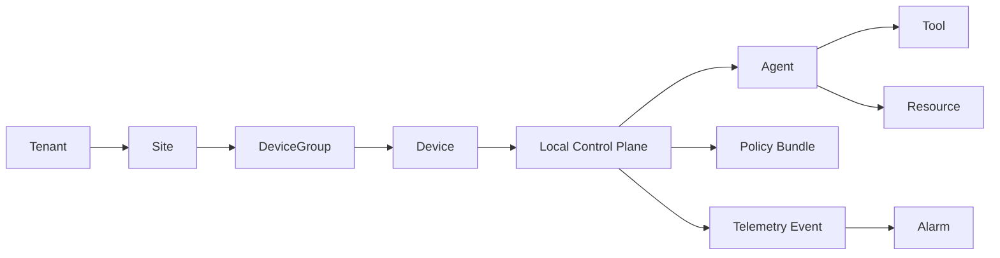

# vCenter-Style UX Research for Pollek Cloud

Pollek Cloud needs an operator console for many Local Control Plane instances. The closest enterprise UX pattern is a vCenter/vCloud Director style console: persistent inventory, dense object tables, detail tabs, alarms, tasks, and relationship context.

## Research Synthesis

| vCenter / Cloud Director Pattern | Pollek Cloud Translation |
|---|---|
| Inventory hierarchy is the primary navigation model. | Tenant > Site > Device Group > Device > Local Control Plane > Agent/Tool/Resource. |
| Object pages use consistent summary and tabbed detail surfaces. | Every object gets Summary, Relationships, Policies, Telemetry, Timeline, Alarms, Bundle Status, Audit, Settings. |
| Datagrid views support scanning many managed objects. | Local Control Planes list needs status, site, version, contract, active bundle, agents, policy coverage, heartbeat, and alarms. |
| Alarms and recent tasks stay visible while working. | Right-side operations rail shows open alarms, long-running tasks, and protocol probe state. |
| Relationship context explains blast radius. | Relationship map links LCPs to agents, bundles, resources, telemetry, incidents, and SPIFFE identity. |
| Provider/cloud director concepts separate provider, organization, virtual data center, and workload scope. | Platform operator, tenant, site/private cloud zone, device group, device/LCP, and agent/resource scope stay distinct. |
| UI density favors operations over marketing. | Compact rows, stable tables, restrained colors, status badges, and object-first copy. |

## Pollek Object Model

## UI Decisions

- Use a persistent left inventory navigator with collapsible tree rows and search.
- Keep the main pane object-centric: breadcrumb, status, risk, quick actions, and tabs.
- Put alarms/tasks/probe controls in a right operations rail so users can act without losing context.
- Use a fleet datagrid as the default tenant/site summary view.
- Preserve protocol truth: the local dev console must show whether an LCP actually fetched Cloud Contract Hub and reported capability data.
- Design for many LCPs: table-first, server-paginated later, with filters by status, site, bundle, contract, and alarm state.

## Sources

- VMware vCenter overview: https://en.wikipedia.org/wiki/VCenter
- VMware vSphere product page: https://www.vmware.com/products/cloud-infrastructure/vsphere
- VMware Cloud Director product page: https://www.vmware.com/products/cloud-infrastructure/cloud-director
- Clarity Design System Datagrid: https://clarity.design/documentation/datagrid
- Clarity Design System Tree View: https://clarity.design/documentation/tree-view
